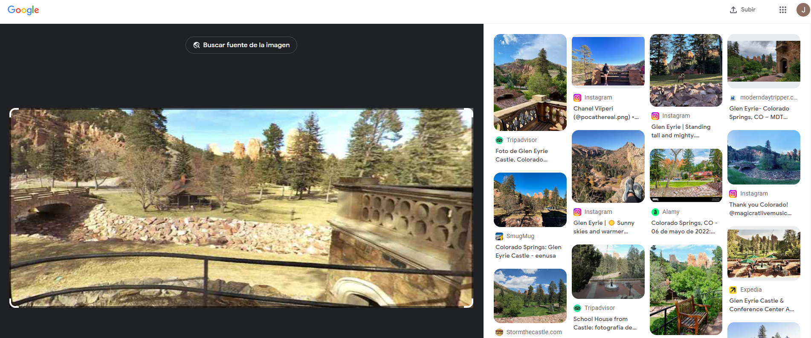
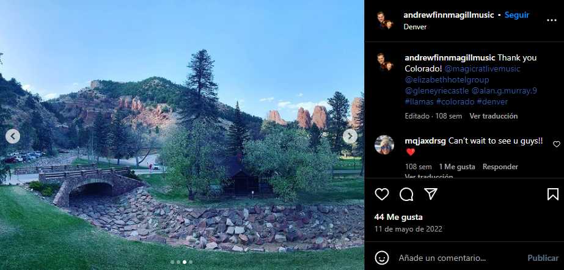
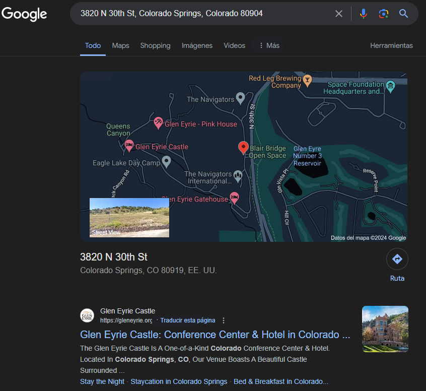
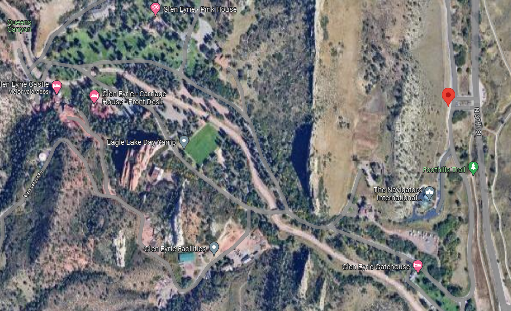
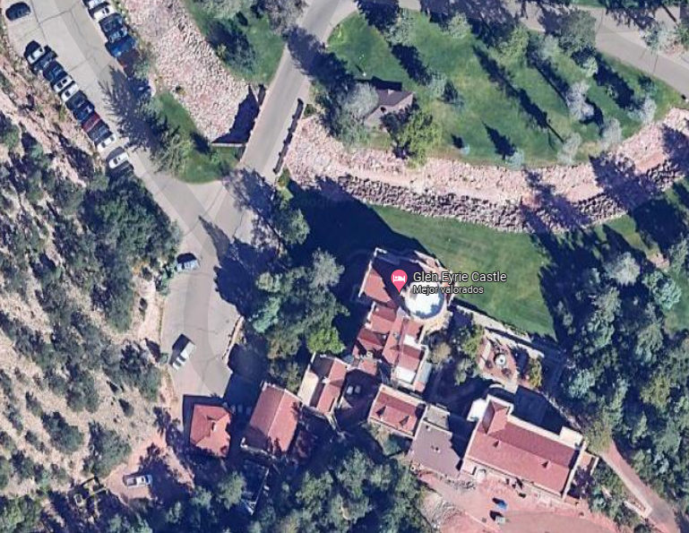

# The Michigan Mistery

| **Category**      | **Level** |
|--------------------|----------|
| Geolocalization 🌍 | Easy ⭐ |

---

Sanaya Patel, an agent for the S.I.S.U. had been working tirelessly and finally decided to take a much-needed vacation. She decided she would spend it in a small town in Michigan, hoping to relax and unwind.

One evening, while exploring the town, she met a man named Thomas Griswold. They hit it off immediately and spent the next few days together, enjoying each other’s company, having a great time. Sanaya felt like she had finally found someone who understood her.

However, things suddenly took a turn for the worse when Thomas started acting strange. He was agitated and on edge. Sanaya could tell that something was bothering him and when she asked if everything was ok he lashed out in a fit of rage, almost hitting her. But he stopped himself and stormed out of the room.

Sanaya was left alone and confused, in a state of shock wondering what had happened. Moments later her confusion soon turned to horror when she heard a commotion outside. She rushed out to find Thomas lying on the ground, with someone rummaging through his pockets. The stranger fled the scene when he saw Sanaya running towards him screaming out.

The Michigan Police Department was called and they began investigating the incident. They questioned Sanaya and with the help of a sketch artist they were able to quickly identify the stranger as Jonathan Bedwell. Jonathan is an accountant in the next county, with no criminal record or history of violence. The whole situation was puzzling, and Sanaya couldn’t understand why someone would kill Thomas.

Sanaya handed the Chief her card and then went and sat in the break room. The Chief contacted the SISU Deputy Director and was inform that Sanaya was a Special Agent. The Chief walked into the break room, “Your Director speaks very highly of you, says you are one of the best. He also said to let you know that Thomas Griswold was a recent ex-member of the criminal organization by the name of ‘Criminopeia’ and that all the resources of the SISU were at your disposal.

It didn’t take long for Jonathan to be apprehended, and in questioning he said that he ran because he was scared. He was looking for a USB that Thomas had told him he had. “Thomas called me yesterday saying that he had information about my daughter but that I was not to contact the police or she would never be found alive. The instructions were to meet him outside the shop and that he would bring me a USB that would provide information about the location of my daughter. “My Juanita has been missing for 4 weeks and you have done nothing to find her. Telling me she probably just ran away.” Thomas said after I had the USB I was to walk into the shop and give it to someone named Sanaya. He said she would know what to do. Everyone turned and looked at Sanaya. She put out her hand to receive the USB, “I am Sanaya.”

Sanaya may still be in shock and we need to help. The image below was all the data contained on the data the USB. Help us find the little girl and bring her back to her father.

As always, Special Agent K. The Contract is yours, if you choose to accept.

## Materials

## Investigation

### 1. Initial Data

#### a. Resume

- Sanaya Patel se va de vacaciones a un pueblo de Michigan
- Aquí conoce a Thomas Griswold
- Tras unos días detecta comportamiento extraño en este
- Una noche, tras gritos, Sanaya encuentra a Thomas en la calle muerto, con un hombre escudriñando sus bolsillos, que escaparía de la escena tras ver a Sanaya aproximarse
- Policía de Michigan interviene el caso y generan un retrato dibujado del hombre descrito por Sanaya
- El hombre es Jonathan Bedwell
- Jefe de policía de Michigan informa a Sanaya que Thomas era un ex miembro de la organización criminal **Criminopeia**
	- `Su Director habla muy bien de usted y dice que es una de las mejores. También dijo que le hiciera saber que Thomas Griswold era un ex miembro reciente de la organización criminal llamada 'Criminopeia' y que todos los recursos de la SISU estaban a su disposición`
- Jonathan es detenido y declara haber huido de la escena por miedo
- Este dice que en la escena del crimen realizaba la búsqueda de un USB que Thomas le había dicho que poseía.
	- `Thomas me llamó ayer diciendo que tenía información sobre mi hija pero que no debía contactar a la policía o nunca la encontrarían con vida. Las instrucciones eran encontrarme con él afuera de la tienda y me traería un USB que me proporcionaría información sobre la ubicación de mi hija.`
	- `Mi Juanita lleva 4 semanas desaparecida y no han hecho nada para encontrarla. Diciéndome que probablemente simplemente se escapó`
- Jonathan dice que Thomas le había comunicado que al tener el USB, debía entrar a la tienda y dárselo a Sanaya (sin conocerla)
- El pendrive contiene una imagen en la cual se aprecia el posible lugar en donde tienen secuestrada a la hija de **Jonathan**

#### b. Sanaya Patel

 - Agente de la SISU
 - Pasó sus vacaciones en un pequeño pueblo de Michigan
 - En el pueblo conoció a **Thomas Griswold**, con el cual hacían buenas migas

#### c. Thomas Griswold

- Ex miembro de la organización criminal **Criminopeia**
- Conoció a **Sanaya Patel** en el pueblo de Michigan
- Tras conocerse con Sanaya presenta comportamiento extraño, agitado y nervioso. Realizó ataque de rabia interrumpido por el mismo contra Sanaya al esta presentar interés en su malestar.

#### d. Jonathan Bedwell

- Contador en el condado vecino
- Sin antecedentes delictuales previos
- Sanaya ve a Jonathan revisando los bolsillos de Thomas (este muerto en la calle)
- Posible asesino de **Thomas**
- Este a sido atormentado por **Thomas** por conocer el paradero de su hija desaparecida

### 2. OSINT

- Buscar imagen en **Google Lens**

- Posiblemente pertenece a un sitio llamado **Colorado Springs: Glen Eyrie Castle**. [Información del sitio turístico aquí](https://eenusa.smugmug.com/North-America-US-Canada-Mexico/USA/Colorado/COS-GlenEyrie)

- Se descubre información en publicación de Instagram de usuario [@andrewfinnmagillmusic](https://www.instagram.com/andrewfinnmagillmusic/)

- Etiqueta indica el hashtag `@gleneyriecastle`

- Se presenta una dirección en al descripción del hotel
	- `3820 N 30th St, Colorado Springs, Colorado 80904`
- Al buscarla en google se obtiene la siguiente info:

- Desde google maps se aprecian las estancias de **Glen Eyrie**, incluido el castillo

- Un acercamiento al castillo

- Se aprecia que la foto inicial corresponde al castillo, la cual incluso fue tomada desde este hacia el quincho del norte.
- A la izquierda se aprecia el puente que correspondería al puente de piedra de la imagen original.
